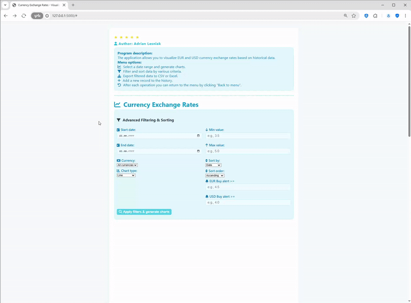

# 📈💹 FlaskFX Visualizer: Currency Exchange Rate Charting 🌐
A Flask web application that displays historical EUR and USD buy/sell exchange rates from a CSV file, featuring advanced filtering, interactive charts, admin panel, change history, export, and a JSON REST API for chart data, powered by Pandas.

**License:** MIT  
**Tech:** Python • Flask • Pandas • openpyxl • HTML/CSS/JS

---

## 📋 Table of Contents
- [Overview](#-overview)
- [Key Features](#-key-features)
- [Screenshots (Conceptual)](#-screenshots-conceptual)
- [System Requirements & Dependencies](#️-system-requirements--dependencies)
- [Data Requirements (history.csv)](#-data-requirements-historycsv)
- [Installation and Setup](#️-installation-and-setup)
- [Usage Guide](#-usage-guide)
- [Project File Structure (Expected)](#️-project-file-structure-expected)
- [Technical Notes & Considerations](#-technical-notes--considerations)
- [Contributing](#-contributing)
- [License](#-license)
- [Contact](#-contact)

---

## 📄 Overview
FlaskFX Visualizer is a web application built with the Flask Python microframework, designed for visualizing historical currency exchange rates. Developed by Adrian Lesniak, it reads EUR and USD buy/sell rate data from a local CSV file (`history.csv`). Users can interact with a modern web interface to filter, search, and export data, view change history, and manage records (admin only). The backend provides a REST API for data access and charting.

<br> 
<p align="center">
  
</p>
<br>

---

## ✨ Key Features
- 📊 **Historical Data Visualization:**
  - Interactive charts (line, bar, average, candlestick) for EUR and USD buy/sell rates.
- 📅 **Advanced Filtering & Sorting:**
  - Filter by date range, currency, min/max value, and sort by any column.
- 🔍 **Search & Pagination:**
  - Search table data by date or value, with paginated results.
- 💾 **Export:**
  - Export filtered data to CSV or Excel.
- 🛡️ **Admin Panel:**
  - Add new records, undo last change, and view change history (admin login required).
- 🕑 **Change History:**
  - View the last 10 added/modified records.
- 🚨 **Alerts:**
  - Set threshold alerts for EUR/USDbuy rates.
- 🧩 **REST API:**
  - Public endpoint for filtered data in JSON format.
- 📝 **Data Versioning:**
  - Undo last change (restore backup).
- 🖥️ **Modern Responsive UI:**
  - Clean, mobile-friendly interface with icons and color.

---

## 🖼️ Screenshots (Conceptual)

- Homepage with advanced filtering and chart options
- Interactive charts for EUR/USD rates
- Data table with search and export
- Admin login and change history

<p align="center">
  
  
  
  
  
</p>


---

## ⚙️ System Requirements & Dependencies
- **Python:** 3.6 or higher
- **Libraries:**
  - Flask
  - pandas
  - openpyxl
  - pytest (for testing)
- **Frontend:**
  - HTML/CSS/JS (with Google Charts, FontAwesome via CDN)
- **Data File:**
  - `history.csv` in project root

Install dependencies:
```bash
pip install flask pandas openpyxl pytest
```

---

## 💾 Data Requirements (history.csv)
The application expects a CSV file named `history.csv` in the project root with the following columns:
- `date_time`: Date and time (e.g., `2023-10-26 10:00:00`)
- `EURbuy`: Euro buy rate (float)
- `EURsell`: Euro sell rate (float)
- `USDbuy`: US Dollar buy rate (float)
- `USDsell`: US Dollar sell rate (float)

**Example row:**
```
2023-10-26 10:00:00,4.4560,4.4780,4.1230,4.1450
```

---

## 🛠️ Installation and Setup
1. **Clone the Repository:**
   ```bash
git clone <repository-url>
cd <repository-directory>
   ```
2. **(Optional) Set Up a Virtual Environment:**
   ```bash
python -m venv venv
source venv/bin/activate  # On Windows: venv\Scripts\activate
   ```
3. **Install Required Libraries:**
   ```bash
pip install flask pandas openpyxl pytest
   ```
4. **Prepare `history.csv`:**
   - Place a properly formatted `history.csv` in the project root.
5. **Run the Flask Application:**
   ```bash
python app.py
   ```
6. **Open in Browser:**
   - Go to [http://localhost:5000](http://localhost:5000)

---

## 💡 Usage Guide
- Launch the app: `python app.py`
- Open your browser at [http://localhost:5000](http://localhost:5000)
- Use the web interface to:
  - Filter and sort data
  - Visualize charts
  - Search and export data
  - Log in as admin to add/undo records
- API and export endpoints are documented below.

---

## 🗂️ Project File Structure (Expected)
```
app.py                # Main Flask backend
history.csv           # Data file (required)
templates/
  index.html          # Main UI
  login.html          # Admin login
static/
  style.css           # CSS styles
README.md             # This documentation
requirements.txt      # (optional)
tests_backend.py      # Backend tests
```

---

## 📝 Technical Notes & Considerations
- **CSV Format:** Strict column names and date formatting required.
- **Frontend:** Charts and UI are implemented in `templates/index.html` using Google Charts and JS.
- **Debug Mode:** Default is `debug=True` for development. Set to `False` in production.
- **Error Handling:** Handles missing files, bad input, and empty data.
- **Large Datasets:** For very large CSVs, consider using a database.
- **Security:** Change the `app.secret_key` in production.

---

## 🤝 Contributing
Contributions are welcome! Ideas for new features, bug fixes, or improvements:
- Fork the repository
- Create a feature branch
- Commit and push your changes
- Open a Pull Request

Please follow Python (PEP 8) and Flask best practices.

---

## 📃 License
This project is licensed under the MIT License. See the LICENSE file for details.

---

## 📧 Contact
Project by Adrian Lesniak. For questions, feedback, or issues, please open an issue on GitHub or contact the repository owner.

---

💹 *Visualizing currency trends with the power of Flask and Pandas!* 